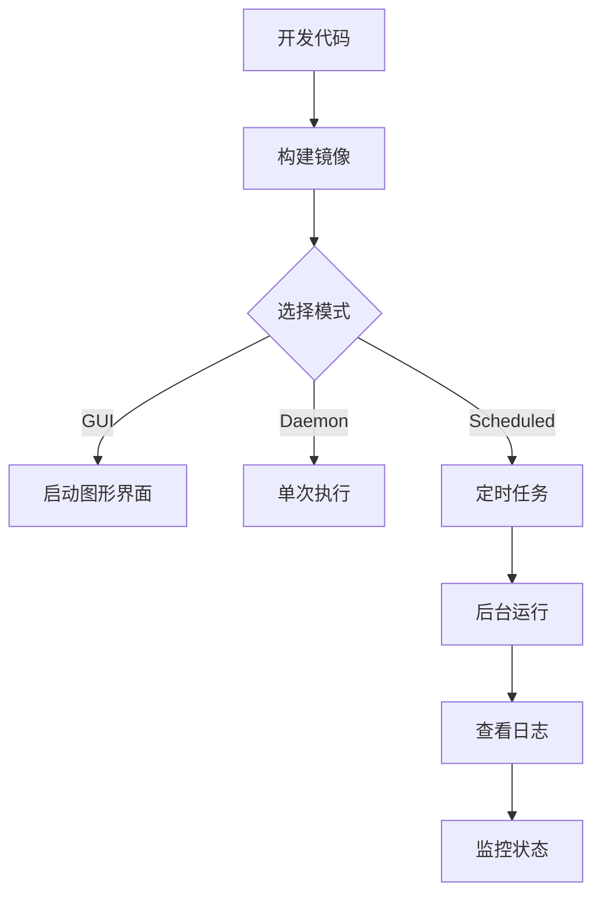

# 🐳 容器化支持实施总结

## ✅ 已完成的工作

### 1. 核心文件

| 文件 | 大小 | 说明 |
|------|------|------|
| `Dockerfile` | 1.8K | 多阶段构建，支持 GUI + Playwright |
| `docker-compose.yml` | 2.0K | 三种运行模式配置 |
| `docker-entrypoint.sh` | 2.2K | 智能入口点脚本 |
| `.dockerignore` | 771B | 优化构建上下文 |
| `.env.example` | 462B | 环境变量模板 |
| `docs/DOCKER.md` | 6.1K | 完整部署文档 |
| `README_DOCKER.md` | 1.7K | 快速开始指南 |

### 2. 支持的运行模式

#### 🖥️ GUI 模式
- X11 转发支持（Linux/macOS）
- 完整图形界面访问
- 实时交互操作

```bash
make docker-gui
```

#### 🤖 守护模式（Daemon）
- 单次执行抢座任务
- 无需图形界面
- 适合 CI/CD 集成

```bash
make docker-daemon
```

#### ⏰ 定时任务模式（Scheduled）
- 基于 cron 的自动调度
- 后台持续运行
- 可自定义执行时间

```bash
make docker-scheduled
```

#### ⚡ 立即执行模式
- 快速运行一次
- 用于测试验证

```bash
docker run --rm -v $(pwd)/data:/app/data hdu-library-sniper:latest run-now
```

### 3. 技术特性

#### 🏗️ 镜像构建
- **基础镜像**: `python:3.11-slim`
- **包管理器**: `uv` (快速依赖安装)
- **浏览器**: Playwright Chromium
- **GUI 支持**: PySide6 完整依赖
- **优化**: 最小化层数，多阶段构建

#### 📦 依赖管理
```dockerfile
# 系统依赖
- PySide6 GUI 库（libgl1, libxcb-*）
- Playwright 浏览器（libnss3, libgbm1）
- 基础工具（curl, ca-certificates）

# Python 依赖
- uv sync --frozen --no-dev
- playwright install --with-deps chromium
```

#### 🔐 安全特性
- 凭据文件权限控制 (chmod 600)
- 敏感数据不打包进镜像 (.dockerignore)
- 支持环境变量和配置文件两种方式
- 可选只读文件系统运行

#### 💾 数据持久化
```yaml
volumes:
  - ./data:/app/data          # 凭据、方案、缓存
  - ./logs:/app/logs          # 运行日志
  - ./config:/app/config      # 配置文件
```

### 4. Makefile 集成

新增 7 个 Docker 相关命令：

```makefile
make docker-build      # 构建镜像
make docker-gui        # GUI 模式
make docker-daemon     # 守护模式
make docker-scheduled  # 定时任务
make docker-logs       # 查看日志
make docker-stop       # 停止容器
make docker-clean      # 清理资源
```

### 5. 配置方式

#### 方式 1: 环境变量
```bash
export HDU_STUDENT_ID="学号"
export HDU_PASSWORD="密码"
docker-compose --profile daemon up
```

#### 方式 2: .env 文件
```bash
cp .env.example .env
# 编辑 .env
docker-compose --profile scheduled up -d
```

#### 方式 3: 凭据文件
```yaml
# data/credentials.yaml
student_id: "学号"
password: "密码"
```

### 6. 智能入口点脚本

`docker-entrypoint.sh` 功能：
- ✅ 自动创建必要目录
- ✅ 环境变量凭据自动写入配置
- ✅ 多种运行模式路由
- ✅ DISPLAY 环境检查
- ✅ Cron 定时任务配置

### 7. 文档支持

#### 完整文档 (`docs/DOCKER.md`)
- 📋 前置要求
- 🚀 快速开始（3 种模式）
- 🔧 配置方式（3 种方法）
- 🔒 安全建议
- 🐛 故障排查
- 📊 监控与日志
- 🌐 高级用例

#### 快速指南 (`README_DOCKER.md`)
- ⚡ 5 分钟上手
- 📝 常用命令速查
- 🔧 自定义配置
- 🐛 常见问题

## 🎯 使用场景

### 场景 1: 本地开发测试
```bash
# 构建镜像
make docker-build

# 启动 GUI 测试
make docker-gui
```

### 场景 2: 服务器部署（定时抢座）
```bash
# 配置凭据
cp .env.example .env
# 编辑 .env 填入学号密码和定时规则

# 启动定时任务（后台运行）
make docker-scheduled

# 查看日志
make docker-logs
```

### 场景 3: CI/CD 集成
```bash
# 在 CI 环境中运行一次
docker run --rm \
  -e HDU_STUDENT_ID="${CI_STUDENT_ID}" \
  -e HDU_PASSWORD="${CI_PASSWORD}" \
  hdu-library-sniper:latest run-now
```

### 场景 4: 多账号部署
```bash
# 账号 1
docker run -d --name sniper-1 \
  -e HDU_STUDENT_ID="学号1" \
  -e HDU_PASSWORD="密码1" \
  -v ./data1:/app/data \
  hdu-library-sniper:latest scheduled

# 账号 2
docker run -d --name sniper-2 \
  -e HDU_STUDENT_ID="学号2" \
  -e HDU_PASSWORD="密码2" \
  -v ./data2:/app/data \
  hdu-library-sniper:latest scheduled
```

## 📊 镜像信息

```
Repository: hdu-library-sniper
Tag: latest
Base: python:3.11-slim
Estimated Size: ~800MB (含 Chromium 浏览器)
```

## 🔄 完整工作流



## ✨ 优势

1. **跨平台**: 在 Linux/macOS/Windows 上一致运行
2. **隔离性**: 不污染宿主机环境
3. **可复现**: 依赖版本锁定
4. **易部署**: 一条命令启动
5. **易扩展**: 支持多实例部署
6. **易维护**: 统一的更新流程

## 🚀 下一步建议

### 可选增强
1. **健康检查**: 添加 Docker healthcheck
2. **镜像优化**: 进一步减小镜像体积
3. **Kubernetes**: 提供 K8s 部署配置
4. **监控集成**: Prometheus/Grafana
5. **日志聚合**: ELK Stack 集成

### 示例 Healthcheck
```dockerfile
HEALTHCHECK --interval=5m --timeout=3s \
  CMD test -f /app/data/session.cache || exit 1
```

## 📝 待办事项

- [ ] 添加 Docker Hub 自动构建
- [ ] 创建 multi-arch 镜像（amd64/arm64）
- [ ] 编写 Kubernetes 部署示例
- [ ] 集成监控告警
- [ ] 添加性能基准测试

## 🎉 总结

容器化支持已完整实施，包括：
- ✅ 完整的 Dockerfile 和 docker-compose.yml
- ✅ 三种运行模式（GUI/Daemon/Scheduled）
- ✅ 智能入口点脚本
- ✅ 详细的文档和快速指南
- ✅ Makefile 集成
- ✅ 安全和最佳实践

项目现在可以完全通过 Docker 部署和运行！
